

<h2 id="uvod">Úvod</h2>

Tento dokument navazuje na Metodiku popisu dat – její přečtení a porozumění je pro následující text nezbytné.

<a href="https://www.archimatetool.com/">Archi</a> je nástroj na modelování v jazyku <a href="https://www.opengroup.org/archimate-forum/archimate-overview">ArchiMate</a>. Nástroj je zadarmo ke stažení i k jakémukoliv využití (podle permisivní licence MIT) a dostupný je pro Windows, Linux i macOS. Jazyk ArchiMate se používá pro vyjádření architektury podniku. Pro Archi jsme vytvořili šablonu pro popis dat, se kterou můžete začít nový projekt, nebo ji lze importovat do vašeho existujícího projektu. Materiál byl psán s verzí 5.4.3 Archi.

<blockquote><a href="https://data.gov.cz/popis-dat">https://data.gov.cz/popis-dat</a></blockquote>

Tento návod nemá za cíl naučit čtenáře používat nástroj jako takový – nýbrž ukázat, jakým způsobem v daném nástroji popisovat data podle metodiky s pomocí připravené šablony.

<h3 id="o-sablone">O šabloně</h3>

Šablona je ve formátu „.architemplate“ (Archi šablona). Postup založení projektu Archi se šablonou popisuje kapitola nápovědy „Creating a New Model from a Template“ v příručce nástroje <a href="https://www.archimatetool.com/downloads/archi/Archi%20User%20Guide.pdf">on-line</a> nebo přímo v nástroji v nabídce „Help“.

<h3 id="slovniky-v-sablone">Slovníky v šabloně</h3>

Šablona obsahuje příkladový slovník z metodiky a Slovník obecných pojmů veřejného sektoru. Těmito slovníky se můžete podle své libosti inspirovat, využít jejich pojmy, nebo je smazat. Jedná se o lokální kopie těchto slovníků, jejich úpravou se publikované verze nijak nemění.

<h2 id="popis-dat-v-nastroji">Popis dat v nástroji</h2>

Pomocí jednoho „modelu“ (souboru) se tvoří jeden slovník. Na tomto slovníku můžete pracovat v libovolném množství pohledů (neboli „<u>views</u><u>“</u>) – vizuální rozpoložení prvků na výsledný slovník nemá žádný vliv.

Při tvorbě slovníku si doporučujeme nástroj nastavit tak, aby bylo snadné kopírovat pojmy z pohledu „Základní šablona“. Tento pohled obsahuje šablony pro subjekty práva, objekty práva a vlastnosti, které obsahují všechny charakteristiky v žádané formě, a jejich kopírováním se tedy snižuje šance překlepů a důsledným problémům s převodem do otevřené formální normy pro slovníky. U vztahů se charakteristiky musí přidávat manuálně (viz podkapitola <a href="#_Vztahy">Vztahy</a>).

Toto nastavení popisuje <a href="https://github.com/archimatetool/archi/wiki/Pattern-based-modelling-with-Archi">příslušná stránka na wiki Archi nástroje (v angličtině)</a>; stručně jde o zobrazení pohledu „Základní šablona“ zároveň s pohledem z modelu, ve kterém na slovníku pracujete – například podle návrhu na obrázku níže:

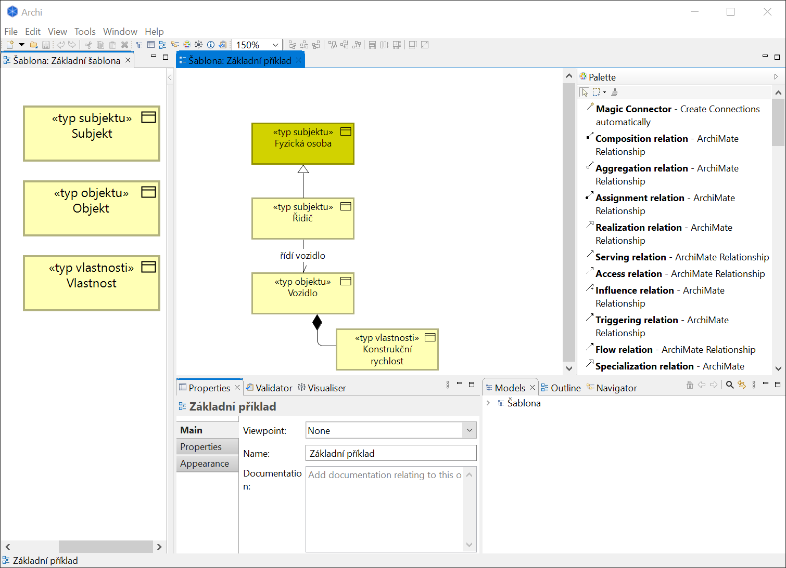

Berte na vědomí, že při kopírování mezi pohledy stejného modelu se při vložení nevytvoří kopie, nýbrž odkaz na kopírovaný pojem. Pokud byste tento odkaz upravovali, tak zároveň upravujete i původní pojem. Pro vytvoření kopie je nutné udělat kopii na stejném plátně (do názvu kopie se přidá „(copy)“), a poté ji případně přesunout do žádaného pohledu.

Každý subjekt práva, objekt práva a vlastnost musí být byznys objekt dle jazyka ArchiMate (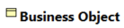), což je zajištěno vytvářením nových pojmů pouze přes kopírování pojmů ze šablony (nebo přes kopírování pojmů vytvořených jako kopií pojmů ze šablony).

<h3 id="nadrazene-pojmy">Nadřazené pojmy</h3>

Nadřazené pojmy se vyjadřují pomocí specializační vazby (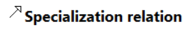), která je dostupná v paletě. Například v základním příkladě ze šablony má „Řidič“ jako nadřazený pojem „Fyzická osoba“.

<h3 id="prirazovani-vlastnosti">Přiřazování vlastností</h3>

Vlastnosti se k subjektům nebo objektům práva přiřazují pomocí kompoziční vazby (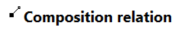) z palety. V základním příkladě ze šablony je vlastnost „Konstrukční rychlost“ přiřazena k „Vozidlo“.

<h3 id="vztahy">Vztahy</h3>

Vztahy mezi subjekty a objekty práva se znázorňují pomocí asociační vazby (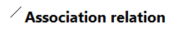 ) z palety. Ujistěte se, že má tato vazba viditelný směr (tj. je při kliknutí na ní v podrobnostech zaškrtlé políčko „Directed“), jak ukazuje obrázek níže:

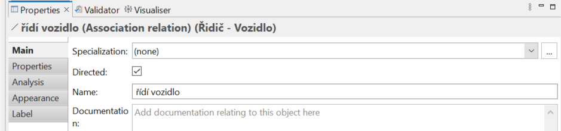

<h3 id="vyplnovani-charakteristik">Vyplňování charakteristik</h3>

Název se pro pojmy i slovníky vyplňuje stejně, jako pro jakýkoliv jiný prvek Archi:

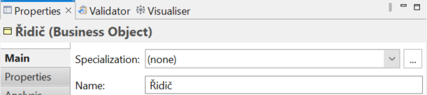

Další charakteristiky se popisují v podrobnostech pojmu v sekci „Properties“:

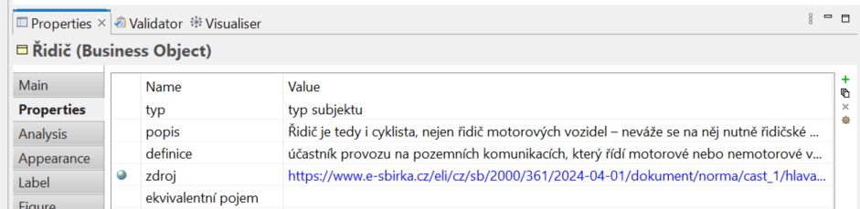

Pro správné zpracování výstupu z nástroje za účelem jeho převedení do slovníku dle OFN je velmi důležité, abyste neměnili názvy níže zmíněných charakteristik, které jsou společné pro všechny subjekty práva, objekty práva a vlastnosti. <em>Doplňující charakteristiky </em>dále upřesňují význam pojmu nad rámec potřebné úrovně z metodiky popisu dat a doporučujeme je vyplňovat až tehdy, kdy je uznáte za potřebné.

<table><tbody><tr><th>Charakteristika</th><th>Popis</th><th>Přípustné hodnoty</th></tr><tr><td>Typ</td><td>O jaký typ pojmu se jedná</td><td>„typ subjektu“ nebo „typ objektu“ nebo „typ vlastnosti“</td></tr><tr><td>Popis</td><td>Popis pojmu</td><td>Volný text</td></tr><tr><td>Definice</td><td>Definice pojmu</td><td>Volný text</td></tr><tr><td>Zdroj</td><td>Zdroj pojmu</td><td>Odkaz URL (ELI), případně volný text</td></tr><tr><td>Ekvivalentní pojem</td><td>Ekvivalentní pojem vyplňovaného pojmu</td><td>Identifikátor IRI</td></tr><tr><td>Identifikátor</td><td>IRI pojmu – nevyplňovat, pokud se jedná o ještě nepublikovaný pojem!</td><td>Identifikátor IRI</td></tr><tr><td>Alternativní název</td><td>Doplňující charakteristika. Další, neoficiální název pojmu (<a href="https://data.gov.cz/popis-dat/znalostní-báze/doplňující-informace/alternativní-název">více informací</a>)</td><td>Volný text</td></tr><tr><td>Ekvivalentní pojem</td><td>Doplňující charakteristika. Ekvivalentní pojem vyplňovaného pojmu (<a href="https://data.gov.cz/popis-dat/znalostní-báze/doplňující-informace/ekvivalentní-pojem">více informací</a>)</td><td>Identifikátor pojmu IRI z publikovaného slovníku</td></tr><tr><td>Související zdroj</td><td>Doplňující charakteristika. Zdroj, který nedefinuje, nýbrž upřesňuje význam pojmu (<a href="https://data.gov.cz/popis-dat/znalostní-báze/doplňující-informace/související-zdroj">více informací</a>)</td><td>Odkaz URL (ELI), případně volný text</td></tr></tbody></table>

<h4 id="charakteristiky-vlastnosti">Charakteristiky vlastností</h4>

Pro vlastnosti je možné vyplnit jednu doplňující charakteristiku:

<table><tbody><tr><th>Charakteristika</th><th>Popis</th><th>Přípustné hodnoty</th></tr><tr><td>Datový typ</td><td>Doplňující charakteristika. Typ očekávaných hodnot vlastností (<a href="https://data.gov.cz/popis-dat/znalostní-báze/doplňující-informace/datové-typy">další informace</a>)</td><td>XSD identifikátor datového typu</td></tr></tbody></table>

<h4 id="charakteristiky-vztahu">Charakteristiky vztahů</h4>

Jelikož nelze v Archi kopírovat vztahy, je nutné je pokaždé znovu vytvářet, zakládat jejich charakteristiky a určit jejich směr. Zakládání charakteristik si však můžete usnadnit pomocí tlačítka „New Multiple…“ napravo od tabulky s charakteristikami v sekci „Properties“ (viz sekce „To Add New Property Entries using Existing Property Names“ v uživatelské příručce). Pro vztahy by zobrazený dialog měl vypadat následovně:

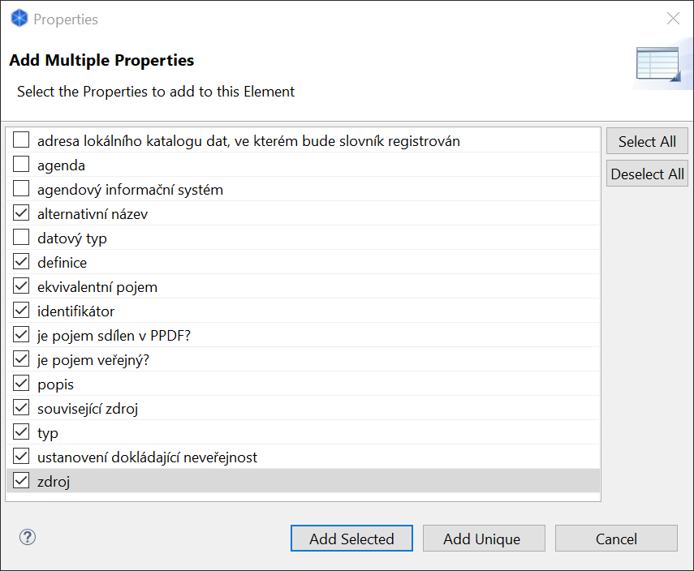

Je možné vybrat všechny charakteristiky pomocí „Select All“ nebo „Add Unique“, strojový převod bude nerelevantní charakteristiky ignorovat.

<h4 id="charakteristiky-slovniku">Charakteristiky slovníku</h4>

Název slovníku musí být unikátní vzhledem ke všem publikovaným slovníkům. Další obecné informace o slovníku se popisují v podrobnostech daného modelu („Properties“) kliknutím na něj v podokně „Models“, například:

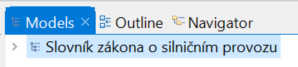

<table><tbody><tr><th>Charakteristika</th><th>Popis</th><th>Přípustné hodnoty</th></tr><tr><td>Popis</td><td>Doplňující informace o slovníku</td><td>Volný text</td></tr><tr><td>Adresa lokálního katalogu dat, ve kterém bude slovník registrován</td><td>Podle této adresy se budou vytvářet identifikátory slovníku a jednotlivých pojmů.</td><td>Odkaz (URL)</td></tr></tbody></table>

<h3 id="vyuzivani-pojmu-z-jinych-slovniku">Využívání pojmů z jiných slovníků</h3>

Tam, kde je mezi přípustnými hodnotami „Identifikátor IRI“, je umožněno pracovat s pojmy z jiných (publikovaných) slovníků. Pro používání těchto pojmů v rozpracovaném slovníku je nutné znát jejich IRI – jen tak poznáme, že jde o pojem z jiného slovníku. To také znamená, že tyto pojmy musí být před využitím katalogizované do Národního katalogu dat, ve kterém slovníky/pojmy vyhledáte a společně s jejich IRI. Slovník obecných pojmů veřejného sektoru má identifikátory IRI zanesené také do šablony.

<h3 id="rozsireni-pro-evidenci-udaju-agendy-do-registru-prav-a-povinnosti">Rozšíření pro evidenci údajů agendy do Registru práv a povinností</h3>

Pokud popisujete subjekty a objekty práva pro jejich následnou reprezentaci v RPP, můžete je popsat detailněji zvláštními charakteristikami definovanými v OFN pro slovníky, uvedeny níže. Pokud se rozhodnete charakteristiky tohoto rozšíření použít, je nutné je vyplnit všechny; jinak jsou neplatné.

<h4 id="subjekty-a-objekty-prava">Subjekty a objekty práva</h4>

<table><tbody><tr><th>Charakteristika</th><th>Popis</th><th>Přípustné hodnoty</th></tr><tr><td>Agenda</td><td>Agenda, do které subjekt/objekt (resp. jeho údaje) patří (je agendový vlastní, tj. nepřebíraný).</td><td>Kód agendy z RPP</td></tr><tr><td>Agendový informační systém</td><td>Agendový informační systém (AIS), pro který jsou údaje subjektu/objektu práva &quot;Agendové vlastní&quot;, tj. nepřebírané.</td><td>Kód ISVS z RPP</td></tr></tbody></table>

<h4 id="vlastnosti-a-vztahy">Vlastnosti a vztahy</h4>

<table><tbody><tr><th>Charakteristika</th><th>Popis</th><th>Přípustné hodnoty</th></tr><tr><td>Je pojem sdílen v PPDF?</td><td>Sdílení údaje (plánované nebo již uskutečněné) v <a href="https://pruvodcepripojenim.gov.cz/">propojeném datovém fondu</a>. „Ne“ znamená „není a nebude sdílen v PPDF“ nebo „je sdílen, ale ne v PPDF“.</td><td>„Ano“ nebo „Ne“</td></tr><tr><td>Je pojem veřejný?</td><td>Určení, zdali je údaj (ne)veřejný, tj. (ne)přístupný veřejnosti.</td><td>„Ano“ nebo „Ne“</td></tr><tr><td>Ustanovení dokládající neveřejnost pojmu</td><td>Ustanovení, ze kterého neveřejnost údaje vyplývá; vyplňuje se právě tehdy, když charakteristika pojmu „Je pojem veřejný?“ je „Ne“.</td><td>Odkaz URL (ELI), případně volný text</td></tr></tbody></table>

<h2 id="publikace-slovniku">Publikace slovníku</h2>

Pro publikaci je potřeba projekt převést do formátu slovníku podle OFN. Slovník pošlete na účet <a href="mailto:data@dia.gov.cz">data@dia.gov.cz</a> v Open Exchange formátu, do kterého je Archi projekt potřeba exportovat (viz sekce „The Open Group Exchange File Format“ uživatelské příručky Archi) s nastavením, které ukazuje obrázek:

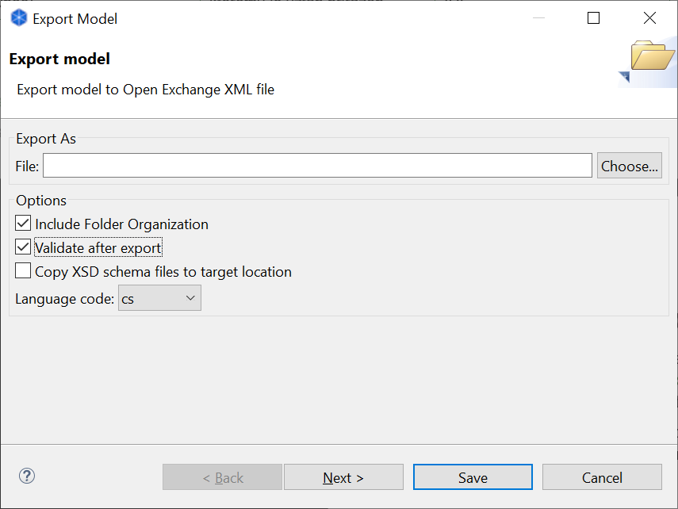

Nezapomeňte zmínit, jaké je zamýšlené využití slovníku (např. evidence údajů agendy do RPP, výkladový slovník apod.). Jakmile slovník schválíme, obdržíte slovník ve formátu dle OFN, který můžete nahrát a poté pro něj vytvořit katalogizační záznam do vašeho Lokálního katalogu dat.

