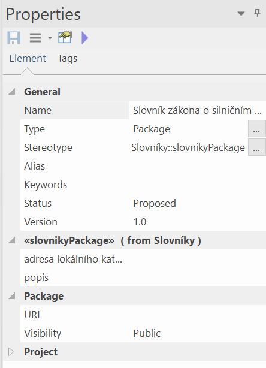
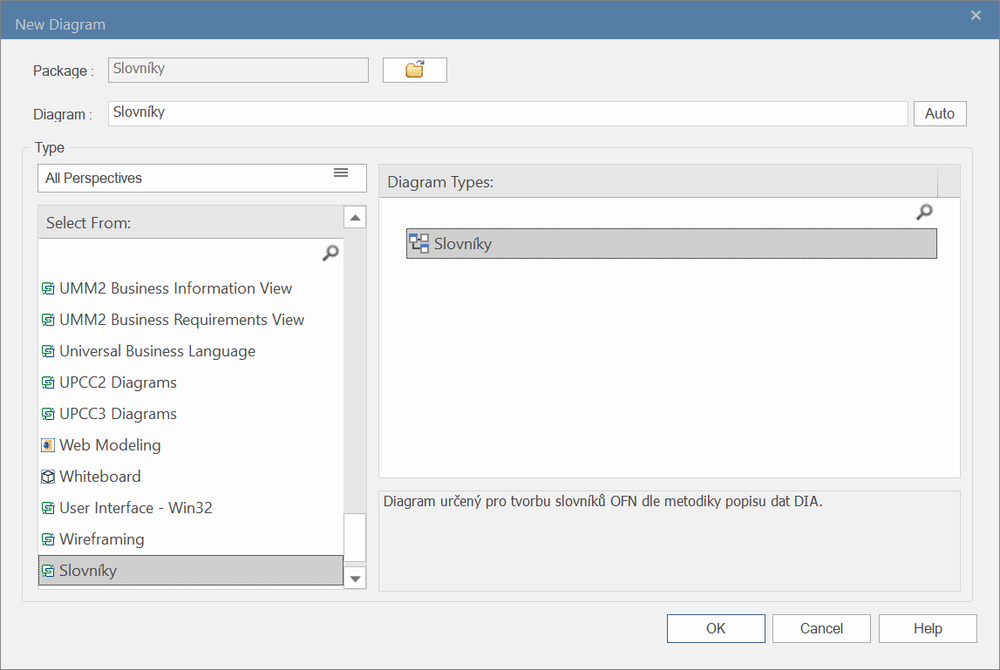
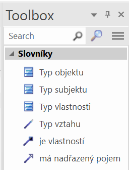
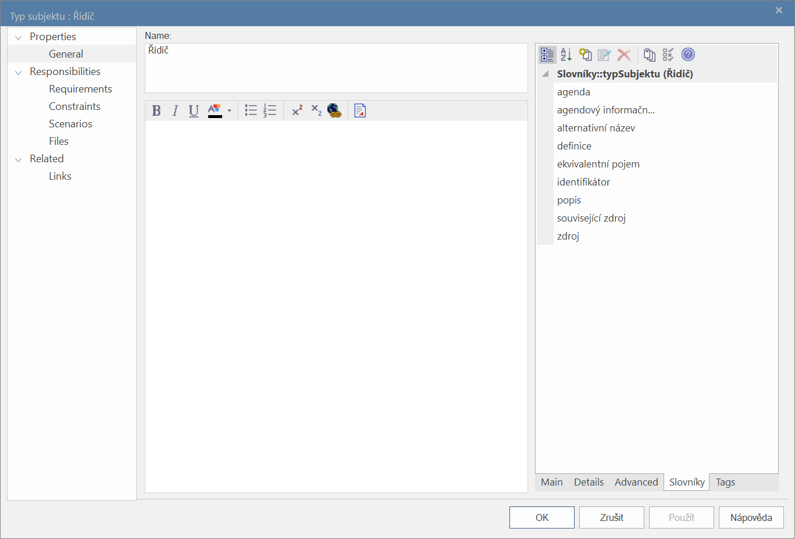
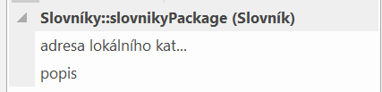
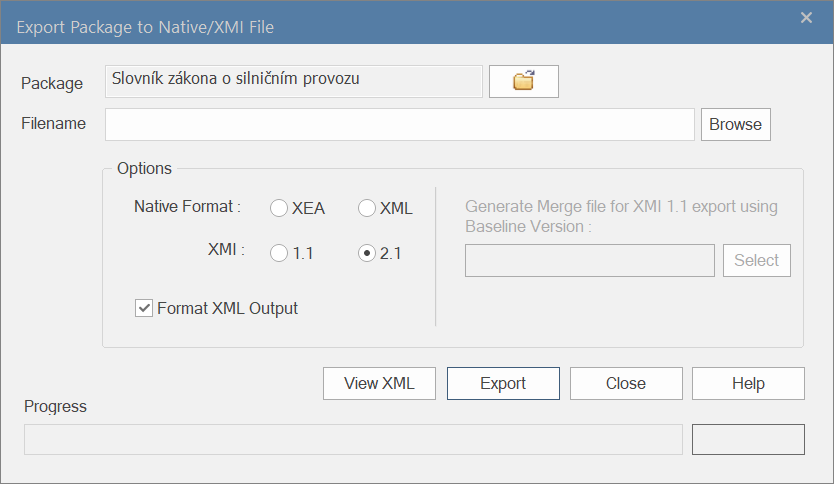

<h2 id="uvod">Úvod</h2>

Tento dokument navazuje na Metodiku popisu dat – její přečtení a porozumění je pro následující text nezbytné. Aktuální verze metodiky je společně s aktuálními informacemi a podpůrnými materiály k popisu dat umístěna na Portálu o datech:

<blockquote><a href="https://data.gov.cz/popis-dat">https://data.gov.cz/popis-dat</a></blockquote>

Tento návod nemá za cíl naučit čtenáře používat nástroj jako takový – nýbrž ukázat, jakým způsobem v daném nástroji popisovat data podle metodiky s pomocí připravené šablony.

<a href="https://sparxsystems.com/products/ea/index.html">Sparx Enterprise Architect</a> (EA) je komerční nástroj, který podporuje několik modelovacích jazyků, včetně ArchiMate a UML. Připravili jsme šablonu v podobě MDG technologie pro popis dat, pomocí které můžete tvořit slovníky. Materiál byl psán s verzí 16.1 Enterprise Architect.

<h3 id="o-mdg-technologii">O MDG technologii</h3>

<a href="https://sparxsystems.com/enterprise_architect_user_guide/16.1/modeling_frameworks/mdg_technologies.html">MDG technologie</a> v sobě obsahuje šablony jednotlivých prvků popisu dat a je pro tvorbu slovníků pomocí Enterprise Architect povinná. Pro její instalaci následujte návod na stránce <a href="https://sparxsystems.com/enterprise_architect_user_guide/16.1/modeling_frameworks/importmdgtechnologies.html">Import MDG Technologies to Model</a> uživatelské příručky EA.

<h3 id="doprovodne-slovniky">Doprovodné slovníky</h3>

Doprovodné slovníky (obsažené také v šablonách pro ostatní podporované nástroje pro popis dat) jsou v samostatném exportu ve formátu „.xml“ (XMI export). Tento soubor se dá importovat do vašeho EA projektu pomocí postupu na stránce <a href="https://sparxsystems.com/enterprise_architect_user_guide/16.1/model_exchange/importxmi.html">Import from XMI</a> uživatelské příručky EA.

Šablona obsahuje příkladový slovník a Slovník obecných pojmů veřejného sektoru. Těmito slovníky se můžete podle své libosti inspirovat, využít jejich pojmy, nebo je smazat. Jedná se o lokální kopie těchto slovníků, jejich úpravou se publikované verze nijak nemění.

<h2 id="popis-dat-v-nastroji">Popis dat v nástroji</h2>

Pomocí jednoho balíčku („package“) se tvoří jeden slovník. Na tomto slovníku můžete pracovat v libovolném množství pohledů (neboli „diagramů“) – vizuální rozpoložení prvků na výsledný slovník nemá žádný vliv. Package musí mit stereotyp &lt;&lt;slovníkyPackage&gt;&gt;, aby se k němu daly vyplnit základní charakteristiky (viz <a href="#_Charakteristiky_slovníku">Charakteristiky slovníku</a>):

Popis dat v EA začíná vytvořením diagramu typu „Slovníky“ v nabídce „New diagram“:

Pokud vytvoření pohledu a instalace MDG technologie proběhla v pořádku, měli byste před sebou vidět prázdný pohled, ke kterému je automaticky přiřazena paleta („toolbox“) obsahující prvky pro popis dat:

Subjekty práva, objekty práva, a vlastnosti jsou vyjádřeny pomocí tříd („krabiček“).

<h3 id="nadrazene-pojmy">Nadřazené pojmy</h3>

Nadřazené pojmy se vyjadřují pomocí vazby , která je dostupná v paletě. Například v základním příkladě ze šablony má „Řidič“ jako nadřazený pojem „Fyzická osoba“.

<h3 id="prirazovani-vlastnosti">Přiřazování vlastností</h3>

Vlastnosti se k subjektům nebo objektům práva přiřazují pomocí vazby  z palety. V základním příkladě ze šablony je vlastnost „Konstrukční rychlost“ přiřazena k „Vozidlo“.

<h3 id="vztahy">Vztahy</h3>

Vztahy mezi subjekty a objekty práva se znázorňují pomocí vazby  z palety. V základním příkladě ze šablony je vyjádřen vztah „řídí vozidlo“ mezi „Řidič“ a „Vozidlo“.

<h3 id="vyplnovani-charakteristik">Vyplňování charakteristik</h3>

Název se pro pojmy vyplňuje stejně, jako pro jakýkoliv jiný prvek EA. Další charakteristiky se popisují v podrobnostech pojmu na kartě „Slovníky“:

Pro všechny subjekty práva, objekty práva, vlastnosti a vztahy jsou společné následující charakteristiky. <em>Doplňující charakteristiky </em>dále upřesňují význam pojmu nad rámec potřebné úrovně z metodiky popisu dat a doporučujeme je vyplňovat až tehdy, kdy je uznáte za potřebné.

<table><tbody><tr><th>Charakteristika</th><th>Popis</th><th>Přípustné hodnoty</th></tr><tr><td>Popis</td><td>Popis pojmu</td><td>Volný text</td></tr><tr><td>Definice</td><td>Definice pojmu</td><td>Volný text</td></tr><tr><td>Zdroj</td><td>Zdroj pojmu</td><td>Odkaz (URL), případně volný text</td></tr><tr><td>Ekvivalentní pojem</td><td>Ekvivalentní pojem vyplňovaného pojmu</td><td>Identifikátor IRI</td></tr><tr><td>Identifikátor</td><td>IRI pojmu – nevyplňovat, pokud se jedná o ještě nepublikovaný pojem!</td><td>Identifikátor IRI</td></tr><tr><td>Alternativní název</td><td>Doplňující charakteristika. Další, neoficiální název pojmu (<a href="https://data.gov.cz/popis-dat/znalostní-báze/doplňující-informace/alternativní-název">více informací</a>)</td><td>Volný text</td></tr><tr><td>Ekvivalentní pojem</td><td>Doplňující charakteristika. Ekvivalentní pojem vyplňovaného pojmu (<a href="https://data.gov.cz/popis-dat/znalostní-báze/doplňující-informace/ekvivalentní-pojem">více informací</a>)</td><td>Identifikátor pojmu IRI z publikovaného slovníku</td></tr><tr><td>Související zdroj</td><td>Doplňující charakteristika. Zdroj, který nedefinuje, nýbrž upřesňuje význam pojmu (<a href="https://data.gov.cz/popis-dat/znalostní-báze/doplňující-informace/související-zdroj">více informací</a>)</td><td>Odkaz URL (ELI), případně volný text</td></tr></tbody></table>

<h4 id="charakteristiky-vlastnosti">Charakteristiky vlastností</h4>

Pro vlastnosti je možné vyplnit jednu doplňující charakteristiku:

<table><tbody><tr><th>Charakteristika</th><th>Popis</th><th>Přípustné hodnoty</th></tr><tr><td>Datový typ</td><td>Doplňující charakteristika. Typ očekávaných hodnot vlastností (<a href="https://data.gov.cz/popis-dat/znalostní-báze/doplňující-informace/datové-typy">další informace</a>)</td><td>XSD identifikátor datového typu</td></tr></tbody></table>

<h4 id="charakteristiky-slovniku">Charakteristiky slovníku</h4>

Název slovníku musí být unikátní vzhledem ke všem publikovaným slovníkům. Další obecné informace o slovníku se popisují v podrobnostech daného balíčku se slovníkem:

<s></s>

<table><tbody><tr><th>Charakteristika</th><th>Popis</th><th>Přípustné hodnoty</th></tr><tr><td>Popis</td><td>Doplňující informace o slovníku</td><td>Volný text</td></tr><tr><td>Adresa lokálního katalogu dat, ve kterém bude slovník registrován</td><td>Podle této adresy se budou vytvářet identifikátory slovníku a jednotlivých pojmů.</td><td>Odkaz (URL)</td></tr></tbody></table>

<h3 id="vyuzivani-pojmu-z-jinych-slovniku">Využívání pojmů z jiných slovníků</h3>

Pro používání jiných pojmů je nutné znát jejich identifikátor (IRI) – jen tak poznáme, že jde o pojem z jiného slovníku. To také znamená, že tyto pojmy musí být před využitím katalogizované do Národního katalogu dat, ve kterém slovníky/pojmy vyhledáte společně s jejich IRI.

<h3 id="rozsireni-pro-evidenci-udaju-agendy-do-registru-prav-a-povinnosti">Rozšíření pro evidenci údajů agendy do Registru práv a povinností</h3>

Pokud popisujete subjekty a objekty práva pro jejich následnou reprezentaci v RPP, můžete je popsat detailněji zvláštními charakteristikami definovanými v OFN pro slovníky, uvedeny níže. Pokud se rozhodnete charakteristiky tohoto rozšíření použít, je nutné je vyplnit všechny; jinak jsou neplatné.

<h4 id="subjekty-a-objekty-prava">Subjekty a objekty práva</h4>

<table><tbody><tr><th>Charakteristika</th><th>Popis</th><th>Přípustné hodnoty</th></tr><tr><td>Agenda</td><td>Agenda, do které subjekt/objekt (resp. jeho údaje) patří (je agendový vlastní, tj. nepřebíraný).</td><td>Kód agendy z RPP</td></tr><tr><td>Agendový informační systém</td><td>Agendový informační systém (AIS), pro který jsou údaje subjektu/objektu práva &quot;Agendové vlastní&quot;, tj. nepřebírané.</td><td>Kód ISVS z RPP</td></tr></tbody></table>

<h4 id="vlastnosti-a-vztahy">Vlastnosti a vztahy</h4>

<table><tbody><tr><th>Charakteristika</th><th>Popis</th><th>Přípustné hodnoty</th></tr><tr><td>Je pojem sdílen v PPDF?</td><td>Sdílení údaje (plánované nebo již uskutečněné) v <a href="https://pruvodcepripojenim.gov.cz/">propojeném datovém fondu</a>. „Ne“ znamená „není a nebude sdílen v PPDF“ nebo „je sdílen, ale ne v PPDF“.</td><td>„Ano“ nebo „Ne“</td></tr><tr><td>Je pojem veřejný?</td><td>Určení, zdali je údaj (ne)veřejný, tj. (ne)přístupný veřejnosti</td><td>„Ano“ nebo „Ne“</td></tr><tr><td>Ustanovení dokládající neveřejnost pojmu</td><td>Ustanovení, ze kterého neveřejnost údaje vyplývá; vyplňuje se právě tehdy, když charakteristika pojmu „Je pojem veřejný?“ je „Ne“</td><td>Odkaz (URL), případně volný text</td></tr></tbody></table>

<h2 id="publikace-slovniku">Publikace slovníku</h2>

Pro publikaci je potřeba projekt převést do formátu slovníku podle OFN. Slovník pošlete na účet <a href="mailto:data@dia.gov.cz">data@dia.gov.cz</a> v XMI formátu, do kterého je balíček („package“) potřeba exportovat (viz sekce <a href="https://sparxsystems.com/enterprise_architect_user_guide/16.1/model_exchange/exporttoxmi.html">Export to XMI</a> uživatelské příručky EA) s nastavením, které ukazuje obrázek:

Nezapomeňte zmínit, jaké je zamýšlené využití slovníku (např. evidence údajů agendy do RPP, výkladový slovník apod.).

Jakmile slovník schválíme, obdržíte slovník ve formátu dle OFN, který můžete nahrát a poté pro něj vytvořit katalogizační záznam do vašeho Lokálního katalogu dat.

