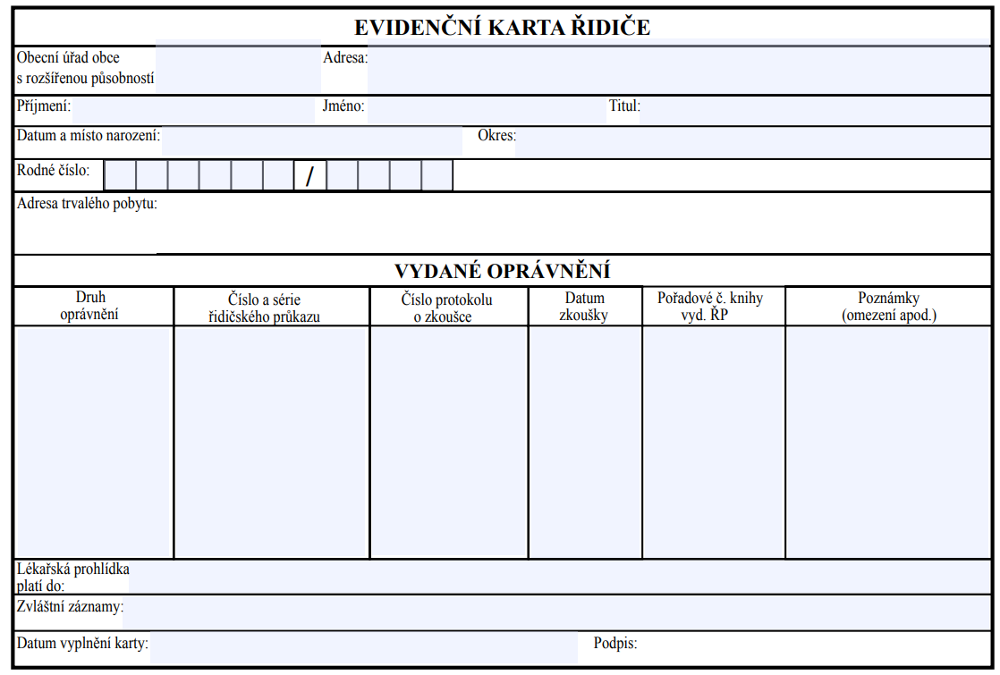
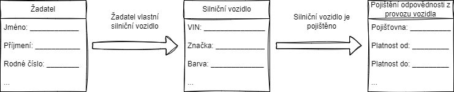

Klíčové koncepty, které budeme dále používat, si přiblížíme na následujícím příkladu formuláře. V <a href="https://www.mdcr.cz/getattachment/Dokumenty/Silnicni-doprava/Elektronicke-formulare-(1)/Formulare-pro-registr-ridicu/Evidencni-karta-ridice.pdf.aspx?lang=cs-CZ">Evidenční kartě řidiče</a> (v obrázku níže) nalezneme jméno, příjmení a další osobní údaje řidiče, spolu se seznamem jemu vydaných oprávnění, uvedením jejich druhu, data zkoušky a dalšími údaji.

Pro každého řidiče je tato karta vyplněna jinak, zatímco formulář zůstává stejný. Např. políčko „Příjmení” může obsahovat hodnotu „Novák”. Tato hodnota „Novák“ je konkrétní příklad příjmení. Podobně „B” je příkladem druhu (řidičského) oprávnění.

<aside class="methodology-callout methodology-callout--note">Nevyplněný formulář (šablona) obsahuje typy údajů (jméno, příjmení, rodné číslo). Vyplněný formulář obsahuje navíc konkrétní údaje (Jan, Novák, 7808243949).</aside>

Formuláře jsou názorné, ale jejich volnost umožňuje jejich tvůrcům dělat chyby, například

<ul>
<li>překlepy,</li>
<li>pojmenování významově stejných políček v různých formulářích různě, např. „Adresa trvalého pobytu”, „Trvalá adresa”,</li>
<li>pojmenování významově různých políček v různých formulářích stejně, např. „Jméno” (řidiče), „Jméno” (vlastníka),</li>
<li>reprezentovat v jediném políčku více informací nebo informaci jedinou, např. „Datum narození”, „Místo narození” vs. „Datum a místo narození”.</li>
</ul>

To komplikuje nejen údržbu těchto formulářů, ale i následné zpracování dat. Proto v dalších částech zavedeme prvky, které nám pomohou tyto problémy odstranit.

<h2 id="pojmy">Pojmy</h2>

Ve formulářích se každé políčko vztahuje k „někomu“ nebo „něčemu“: příjmení <em>žadatele</em>, adresa <em>firmy</em>, evidenční číslo <em>faktury</em>. Častokrát jsou formuláře rozděleny na sekce podle těchto položek, aby se dalo snadno rozlišit mezi vyplňováním např. jména žadatele a jména dítěte.

Pro popis dat je důležité si všimnout následujícího:

<ul>
<li>Ke stejným položkám (k „někomu“, „něčemu“) se vážou stejná políčka – tj. každý žadatel má jméno, příjmení, adresu bydliště apod., každé silniční vozidlo má VIN, značku atd., která se využívají napříč formuláři.</li>
<li>Bez kontextu formuláře se informace o žadateli apod. nedají využít a není jasné, proč je potřeba je uchovávat (a kdo je má uchovávat). Jedná se o informace žadatele o řidičský průkaz, o pracovní pozici na Ministerstvu dopravy, o registraci silničního vozidla?</li>
</ul>

Seskupování dat do „kategorií“ reprezentujících osobu, věc nebo koncept z reálného světa je běžná praxe a jejich standardizovaná evidence s předpřipravenými údaji (políčky) a s propojeními mezi sebou pomocí vazeb je dobrý způsob, jak si v nich udělat pořádek.

Základním nástrojem pro evidenci těchto prvků je <strong>pojem</strong>. Pojem je slovo nebo sousloví opatřené definicí, zdrojem, příp. dalšími charakteristikami, které zpřesňují jeho význam tak, aby se omezila možnost špatně mu porozumět nebo jej špatně použít.

<aside class="methodology-callout methodology-callout--note">Nejde tedy o samotné slovo nebo sousloví, ale právě o daný význam, který je tímto slovem nebo souslovím pojmenován.</aside>

Strukturováním dat do pojmů získáváme pomyslné šablony „kousků“ formulářů. Tyto „kousky“ se pak dají skládat podle toho, jaký vztah mají jednotlivé pojmy mezi sebou.

<aside class="methodology-callout methodology-callout--good">Formulář <a href="https://md.gov.cz/getattachment/Dokumenty/Silnicni-doprava/Elektronicke-formulare-(1)/Elektronicke-formulare/Zadost-o-zapis-silnicniho-vozidla-do-registru-silnicnich-vozidel-(4).pdf.aspx?lang=cs-CZ">Žádost o zápis silničního vozidla do registru silničních vozidel</a> toto dobře ilustruje: <em>Žadatel </em>se v rámci formulářů opakuje často, a často se od něj chtějí ty stejné údaje – což slouží jako perfektní příklad „šablony“. Pro posouzení registrace vozidla se samozřejmě zvažuje i vozidlo, které žadatel vlastní – <em>Silniční vozidlo</em>, které má také svá políčka. Obdobně pak i <em>P</em><em>ojištění odpovědnosti z provozu vozidla</em>, jeho políčka<em> </em>a další části, které se poté pomocí vazeb s ostatními pojmy dostává do jednoho formuláře – viz obrázek.<em> </em><em> </em></aside>

Analogicky je tomu i u dat a jejich správy obecně – data jsou propojena vazbami, které dále doplňují kontext a umožňují podrobnější dotazování (do kdy je platný řidičský průkaz, který patří fyzické osobě Jan Novák?)

Každý pojem může popisovat buď:

<ul>
<li>Subjekt práva (osobu, „někoho“) - Žadatel,</li>
<li>Objekt práva (věc, koncept, „něco“) – Silniční vozidlo,</li>
<li>Vlastnost subjektu/objektu práva („políčko formuláře“) – Příjmení žadatele,</li>
<li>Vztah mezi subjekty/objekty práva (věcné propojení) – Žadatel vlastní silniční vozidlo.</li>
</ul>

Určité pojmy („šablony“) se mohou používat nejen v rámci jedné oblasti nebo jedné organizace, ale i v jiných: například Řidič se hodí nejen pro resort dopravy (registr řidičů), ale také pro policii (delikty při řízení/provozování vozidla) a pojišťovny (pojištění odpovědnosti z provozu vozidla). Zároveň se může stát, že si každý „Řidiče“ vykládá trochu jinak (tj. mají pro něj jinou definici), jak bylo zmíněno v kapitole 2 <a href="motivace-popisu-dat#_Úvod_popisu_dat">Motivace popisu dat</a>.

Pro tyto případy je důležité jednak určit tvůrce pojmu, který vlastní i samotná data a také kontext (věcná oblast), ve kterém je daný pojem s danou definicí používán (Řidič jako řidič motorových vozidel a řidič podle definice zákona o silničním provozu). Organizaci pojmů do „balíčků“ podle oblasti a gestora zajišťují <strong>slovníky</strong>.

<h2 id="slovniky">Slovníky</h2>

Slovníkem rozumíme lidsky i strojově čitelnou jednotku správy pojmů – popisující <a href="tvorba-popisu-dat#_Subjekty_a_objekty_2">subjekty práva a objekty práva</a> s jejich <a href="tvorba-popisu-dat#_Vlastnosti">vlastnostmi</a>, <a href="tvorba-popisu-dat#_Vztahy">vztahy</a> a <a href="tvorba-popisu-dat#_Charakteristiky_pojmu_1">dalšími charakteristikami</a>. Slovník je vytvářen pro určitou oblast. Tou může být například odborná oblast (slovník územního plánování), normativní dokument (slovník zákona č. 283/2021 Sb.), agenda (slovník agendy A1046 Agenda řidičů), nebo třeba datová sada (slovník datové sady eSbírka). Konkrétnímu úřadu (resp. oddělení nebo osobě v ní působící) by měla být přiřazena zodpovědnost za jeho kvalitu, přesnost, a úplnost (vzhledem k dané doméně). <s> </s>

Každý slovník se dá popsat těmito charakteristikami:

<ul>
<li>Název (povinný) – označující, jakou oblast slovník popisuje.</li>
<li>Popis (volitelný) – doplňující poznámka, upřesňující např. vybrané zdroje nebo účely použití slovníku.</li>
</ul>

V rámci Strategie se v této metodice konkrétně mluví o <em>datových slovnících</em><em> </em>(popsaných mj. v opatření 1.3.1 Strategie), což je takový slovník, který popisuje data vedená v informačních systémech veřejné správy. Pro to, aby slovník splňoval minimální standardy pro popis dat, stačí, aby obsahoval subjekty a objekty práva. Od míry podrobnosti uvedených informací se ale odvíjí využitelnost slovníků pro aktivity zmíněné v kapitole 2 <a href="motivace-popisu-dat#_Úvod_popisu_dat">Motivace popisu dat</a> – čím více detailu do slovníku vložíme, tím širší použitelnost od něj můžeme očekávat (další informace viz podkapitola 5.1 <a href="tvorba-popisu-dat#_Úrovně_popisu_dat_2">Úrovně popisu dat</a>).

